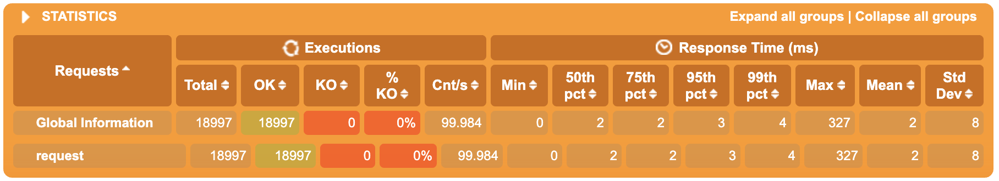

# Kafka project skeleton

## About this project

### Exception handling

Since default exception handles for batch doesn't support Not Retriable Exceptions (like it is possible for non batch listeners) the following handler was introduced:

```java
public class NREBatchErrorHandler extends SeekToCurrentBatchErrorHandler {

  // todo add more fatal exceptions here like ConstaintViolation etc
  private final static List<Class<?>> NOT_RETRIABLE_EXCEPTIONS =
      List.of(NotRetriableException.class);
```

### Tests

For the listener testing `spring-kafka-test` package was used with @EmbeddedKafka [MessageListenerTest.java](src/test/java/com/spimenov/buildingblocks/kafka/listener/MessageListenerTest.java)

```java
@EmbeddedKafka(topics = {"${kafka.consumer.topic-name}"}, partitions = 1,
    bootstrapServersProperty = "spring.kafka.bootstrap-servers")
public class MessageListenerTest {
  
}
```

Test scenarios covers success and common failure cases

| Test name | Description |
| --------- | ----------- |
| shouldHandleBatchOfEvents() | Checks success case. Batch of 10 events is processed |
| shouldSkipEventsWithEmptyMessages() | Verifies logic from EmptyMessagesFilterStrategy about discarding messages with not applicable data |
| shouldHandleErrorAsRetry() | Verifies retry is applied when runtime exception happens within listener code |
| shouldSkipFatalErrorWithoutRetryAndProceedWithNextBatch() | Verifies that exception included to the set of Not Retriable Exceptions doesn't lead to retry and the whole batch is discarded |

## Running the application 

1. Run kafka within docker
```shell script 
docker-compose up
```

2. Create topic 
```shell script
kafka-topics --create --zookeeper localhost:2181 --replication-factor 1 --partitions 2 --topic msg-topic
```

3. Run the listener
```shell script
./gradlew client-kafka:bootRun
```

4. Send test message
```shell script
kafka-console-producer --broker-list localhost:9092 --topic msg-topic
> {"messages": [{"messageId": 1, "payload": "string"}, {"messageId": 2, "payload": "string2"}]}
```

## Benchmarking

### Environment

To be installed:
1. Scala (`brew install scala`) 
2. Gatling
3. Gatling's [kafka-plugin](https://github.com/mnogu/gatling-kafka)

### Test plan

- Batch handling time is a normal distribution with mean 50ms and standard deviation 15ms
- Producer send 100 messages per second
- Kafka topic partitions = 2
- Consumer instances = 1 (consume from both partitions)

### Run performance test

```shell script
gatling.sh -sf gatling-simulations -s com.spimenov.kafka.test.ShakeKafka
```
For details see test plan [ShakeKafka](gatling-simulations/ShakeKafka.scala)

### Test Results

1. Gatling successfully simulate 100 messages per seconds


2. Sample listener output demonstrate how batches are organized are being handled:
```text
2020-04-16 02:10:50.763  INFO 15270 --- [-listener-0-C-1] c.s.b.kafka.listener.MessageListener     : batch receive start --> 6 events
2020-04-16 02:10:50.763 DEBUG 15270 --- [-listener-0-C-1] c.s.b.kafka.listener.MessageListener     : batch receive detailed: partition-offset='0-27111', message='MessageEvent(messages=[MessageEvent.Message(messageId=975930597, payload=some payload), MessageEvent.Message(messageId=975930597, payload=some additional payload)])'
2020-04-16 02:10:50.763 DEBUG 15270 --- [-listener-0-C-1] c.s.b.kafka.listener.MessageListener     : batch receive detailed: partition-offset='0-27112', message='MessageEvent(messages=[MessageEvent.Message(messageId=568038235, payload=some payload), MessageEvent.Message(messageId=568038235, payload=some additional payload)])'
2020-04-16 02:10:50.763 DEBUG 15270 --- [-listener-0-C-1] c.s.b.kafka.listener.MessageListener     : batch receive detailed: partition-offset='0-27113', message='MessageEvent(messages=[MessageEvent.Message(messageId=2010635110, payload=some payload), MessageEvent.Message(messageId=2010635110, payload=some additional payload)])'
2020-04-16 02:10:50.763 DEBUG 15270 --- [-listener-0-C-1] c.s.b.kafka.listener.MessageListener     : batch receive detailed: partition-offset='1-27175', message='MessageEvent(messages=[MessageEvent.Message(messageId=1061513995, payload=some payload), MessageEvent.Message(messageId=1061513995, payload=some additional payload)])'
2020-04-16 02:10:50.763 DEBUG 15270 --- [-listener-0-C-1] c.s.b.kafka.listener.MessageListener     : batch receive detailed: partition-offset='1-27176', message='MessageEvent(messages=[MessageEvent.Message(messageId=706584782, payload=some payload), MessageEvent.Message(messageId=706584782, payload=some additional payload)])'
2020-04-16 02:10:50.763 DEBUG 15270 --- [-listener-0-C-1] c.s.b.kafka.listener.MessageListener     : batch receive detailed: partition-offset='1-27177', message='MessageEvent(messages=[MessageEvent.Message(messageId=33027849, payload=some payload), MessageEvent.Message(messageId=33027849, payload=some additional payload)])'
2020-04-16 02:10:50.811  INFO 15270 --- [-listener-0-C-1] c.s.buildingblocks.service.TestService   : processing took: 47 ms
2020-04-16 02:10:50.811  INFO 15270 --- [-listener-0-C-1] c.s.b.kafka.listener.MessageListener     : batch receive end <-- 
```

3. Batch size never rich it maximum = 10 meaning that 1 consumer instance is enough to handle 100 messages per second


